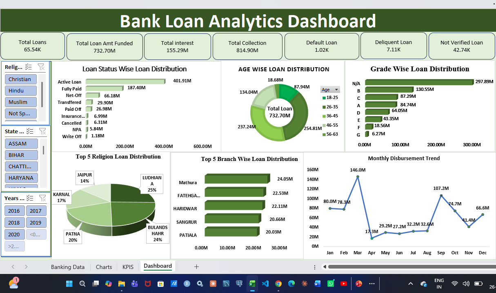
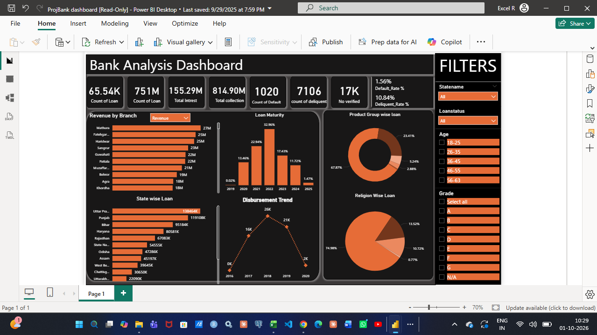

# 🏦 Bank Loan Portfolio Analysis

## 📌 Project Overview

End-to-end analysis of a bank loan portfolio of **65.5K loans**. The raw data was cleaned in **SQL (MySQL)**, analysed through **18 KPIs**, and presented in **Excel** and **Power BI** dashboards.

## 🎯 Business Objective

- Measure overall portfolio performance: funded amount, collections and interest
- Understand loan distribution by branch, state, product, grade and age group
- Track default and delinquency to identify higher-risk segments
- Support portfolio and credit-risk monitoring with clear insights

## 🛠️ Tools & Technologies

| Tool | Purpose |
|---|---|
| MySQL | Data cleaning and KPI analysis |
| Excel | Dashboard with slicers |
| Power BI | Interactive dashboard with filters |

## 🔄 Project Workflow

```text
Raw Loan Data (CSV)
      ↓
Data Cleaning (SQL)
      ↓
18 KPI Queries (SQL)
      ↓
Excel Dashboard  +  Power BI Dashboard
      ↓
Business Insights
```

## 🧹 Data Cleaning Steps

1. Created a working copy of the raw table (`loan_clean`)
2. Renamed misspelled columns (for example `Total_Pyament` → `total_payment`)
3. Checked NULL and blank values in text and numeric columns
4. Replaced missing Religion, Verification Status, Grade, Sub Grade and Home Ownership with `Unknown`
5. Trimmed spaces and standardised text capitalisation
6. Converted dates (`dd/mm/yyyy` and `dd-mm-yyyy`) to the DATE type
7. Converted Center ID and amount columns to correct data types
8. Checked duplicate Account IDs
9. Validated loan amounts before calculating KPIs

## 📊 The 18 KPIs

| # | KPI | Result |
|---|---|---|
| 1 | Total Loan Amount Funded | 732.70M |
| 2 | Total Loans | 65.54K |
| 3 | Total Collection | 814.90M |
| 4 | Total Interest | 155.29M |
| 5 | Branch-Wise Performance (interest, fees, revenue) | Mathura leads on revenue |
| 6 | State-Wise Loan | Uttar Pradesh is highest by funded amount |
| 7 | Religion-Wise Loan | See dashboard |
| 8 | Product Group-Wise Loan | See dashboard |
| 9 | Disbursement Trend | See dashboard |
| 10 | Grade-Wise Loan | See dashboard |
| 11 | Default Loan Count | 1,020 |
| 12 | Delinquent Loan Count | 7,106 |
| 13 | Default Loan Rate | 1.56% |
| 14 | Delinquent Loan Rate | 10.84% |
| 15 | Loan Status-Wise Loan | Active loans are the largest status |
| 16 | Age Group-Wise Loan | See dashboard |
| 17 | Not Verified Loans | See dashboard |
| 18 | Loan Maturity (Term) | See dashboard |

## 🔍 Key Insights

- The portfolio funded **732.70M** and collected **814.90M**, with **155.29M** earned as interest
- Delinquency (**10.84%**) is much higher than default (**1.56%**), so early collection follow-up matters more than recovery
- A large share of loans has no grade (N/A), which limits credit-risk analysis; grade capture should improve
- Mathura, Fatehgarh and Haridwar are the top branches by revenue
- Uttar Pradesh, Punjab and Bihar are the top states by funded amount

## 📸 Dashboards

### Excel Dashboard


### Power BI Dashboard


## 📁 Repository Structure

```text
├── sql/
│   ├── 01_data_cleaning.sql
│   └── 02_kpi_analysis.sql
├── excel/            Excel dashboard workbook
├── powerbi/          Power BI dashboard file
├── screenshots/      Dashboard images
├── LoanData.csv      Raw dataset
└── README.md
```

## 👤 Author

**Prasad S** | Data Analyst
[LinkedIn](https://www.linkedin.com/in/prasadsprasu) | [GitHub](https://github.com/PRASADS877)
